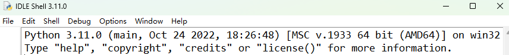
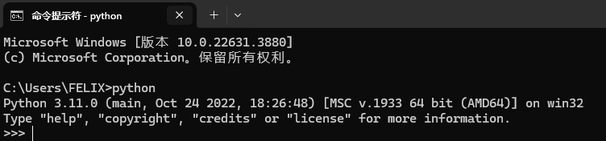

### 有两个版本，不兼容
1. **Choose v3.x**： Python的2.x和3.x版本不兼容，现在基本都用最新的3.x，不要安装老版本。只有在用别人编好的特定的库的时候指定了2.x的基础，才需要老版本。
2. **Python.org**：[python官方主页](https://www.python.org/), 基础软件安装尽量去官网按照步骤一步步做下去。
3. **Initial window**: 官方安装后，两个方法进入最简单的编程窗口。一个是自带的IDLE，一个windows的CMD窗口进入python交互对话。

### Python Interpreter：
1. **Interpreter**： 就是.py等python文件运行需要的核心。就是他把你的代码翻译给cpu。
2. **CPython和IPython**：最常用的两个解释器，Cpython就是刚才官网下载的，它是C语言开发的，对整个.py文件进行解释。IPython是交互式解释器，就是你说一句他执行一句，比如Jupiter的解释器。 
3. PyPy， Jython，IronPython等其他解释器，特定场景用。